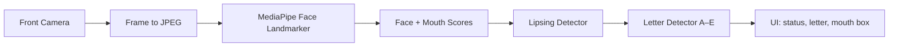

# Lipsing Detection — Signly Flutter App

**Project:** Sign Language Translate (mobile_offline)  
**Feature:** Real-time mouth movement detection from the front camera  
**Audience:** University presentation (easy English)

---

## Overview

### What is lipsing?

**Lipsing** means moving your lips and mouth as if you are speaking, but **without making sound**. People who are deaf or hard of hearing often use lipsing to show words to someone who can read lips.

### Lipsing vs. lip reading

| Term | Meaning |
|------|---------|
| **Lipsing** | The *action* of mouthing words (moving the mouth). |
| **Lip reading** | The *skill* of understanding full speech by watching someone’s lips. |

This feature detects **mouth activity** (lipsing: yes or no) and simple **mouth shapes** for letters **A–E**. It does **not** perform full lip reading of words or sentences.

### Where to find it in the app

Open **Translate** → tap **Lips Detection**. The screen opens the front camera and shows live results.

---

## How It Works

Processing runs on the phone in a loop, about every **150 ms** (roughly 6–7 times per second).

### Step by step

1. **Camera** — The app starts the front camera at the best resolution the device supports (very high → high → medium).
2. **Encode frame** — Each camera frame is converted to JPEG for the native face engine.
3. **Face detection** — MediaPipe finds one face and reads **face blendshapes** (numbers that describe mouth shape: open, smile, pucker, etc.).
4. **Mouth box** — Six lip landmarks are used to draw a rectangle around the mouth on the preview.
5. **Lipsing decision** — The app checks if the mouth is open enough **or** moving enough over recent frames. Hysteresis (a short delay) stops the Yes/No label from flickering.
6. **Letter guess (A–E)** — Rules map mouth scores to one of five letters, with smoothing over the last few frames.
7. **Display** — The UI shows face status, lipsing yes/no, detected letter, confidence, and mouth metrics.

---

## Technical Components

| Layer | Technology | Role |
|-------|------------|------|
| **UI** | Flutter (`LipsDetectionScreen`) | Camera preview, status cards, letter chips, mouth overlay |
| **Camera** | `camera` plugin (YUV420) | Live video from front camera |
| **Bridge** | Flutter Method Channel `asl/offline/face` | Sends JPEG bytes to native code |
| **Native (Android)** | `FaceLandmarkerBridge.kt` | Runs MediaPipe Face Landmarker |
| **Native (iOS)** | `FaceLandmarkerBridge.swift` | Same model and logic on iOS |
| **Model** | `face_landmarker.task` | MediaPipe task file in app assets |
| **Logic** | `LipsingDetector` | Temporal yes/no for lipsing |
| **Logic** | `LipLetterDetector` | Rule-based classifier for A–E |
| **Data** | `FaceLipsResult` | Shared result object for all scores |

MediaPipe outputs **blendshape** scores (0.0–1.0), for example:

- `jawOpen` → mouth open  
- `mouthPucker`, `mouthFunnel` → round lips  
- `mouthSmileLeft/Right`, `mouthStretchLeft/Right` → smile / wide mouth  
- `mouthClose` → closed mouth  

The native bridge also returns a **mouth bounding box** (normalized x/y coordinates) for the overlay on the camera preview.

---

## Letter Detection (A–E)

Letters are **not** learned by a deep neural network in this feature. They come from **hand-written rules** (a decision tree) on smoothed mouth features.

**Priority order:** E → C → B → A → D (the most distinctive shape wins first).

| Letter | Mouth shape (rule of thumb) |
|--------|----------------------------|
| **A** | Wide open mouth, low smile and pucker |
| **B** | Closed mouth |
| **C** | Round / puckered lips |
| **D** | Slightly open (mid range) |
| **E** | Smile or stretched mouth |

The detector uses a **5-frame median** to reduce noise and **2-frame hysteresis** before locking a displayed letter. A minimum score (~28%) is required before showing a letter.

**Practice mode:** Tap a letter chip (A–E) to set a **target**. When the detected letter matches, the UI shows **“Matched!”** in green.

---

## UI Features

- **Live camera preview** with a mouth overlay box (teal when idle, green when lipsing).
- **Status cards:** Face detected / not detected; Lipsing Yes / No.
- **Detected letter** with confidence percentage.
- **Letter chips A–E** for target selection and match feedback.
- **Mouth open** progress bar (0–100%).
- **Extra metrics:** Pucker, Smile, Close, Funnel, Stretch.
- **Camera resolution label** under the preview (e.g. `Camera: 1280×720`).
- **Scrollable layout** so content fits on small screens without overflow.
- **Retry button** if camera or model initialization fails.

---

## Limitations

1. **Not true lip reading** — The app does not decode words or sentences from lips.
2. **Heuristic shapes only** — Letters A–E are guessed from simple rules, not from a trained lip-reading model.
3. **Five letters only** — The full alphabet is not supported in this module.
4. **Lighting and angle** — Poor light, side angles, or a partially hidden face reduce accuracy.
5. **Single face** — MediaPipe is configured for **one face** at a time.
6. **Device dependent** — Camera quality and CPU speed affect frame rate and stability.
7. **Similar mouth shapes** — Some letters can be confused (e.g. mid-open vs. wide open) because rules overlap.

These limits are acceptable for a **demonstration and learning tool**, not for clinical or legal communication.

---

## Recent Improvements

| Improvement | Benefit |
|-------------|---------|
| **Higher camera resolution** | Tries veryHigh, then high, then medium for sharper face input |
| **Scroll / overflow fix** | `SingleChildScrollView` prevents layout overflow on small phones |
| **Target letter matching** | User picks A–E; app confirms when detection matches |
| **Horizontal mouth box** | Overlay is forced to a wide lip band (not a tall vertical bar), with correct portrait/landscape mapping and front-camera mirroring |

---

## Future Work

- Train a **machine learning model** for more letters or simple words.
- Support **Arabic / sign-language-specific** viseme mapping if required by the project.
- Add **recording and replay** for offline analysis or dataset building.
- Improve performance with **GPU** or lower-resolution Region-of-Interest (mouth-only crop).
- Calibrate thresholds **per user** for better personal accuracy.
- Link detected letters to **sign language animations** elsewhere in Signly.

---

## Summary

The **Lipsing Detection** feature uses the phone camera and **MediaPipe Face Landmarker** to track the face and mouth in real time. Flutter handles the UI; native Android/iOS code runs the model. The app answers: *Is a face visible? Is the user lipsing? Which simple mouth shape (A–E) best matches?* It is a practical step toward mouth-aware sign language tools, with clear limits and room for future research.
