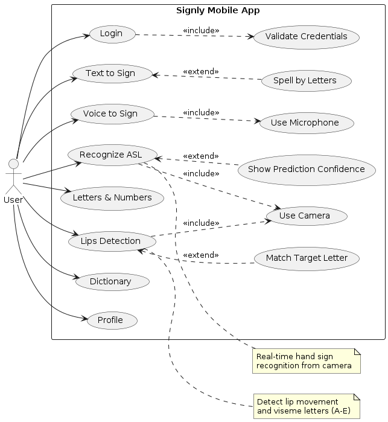
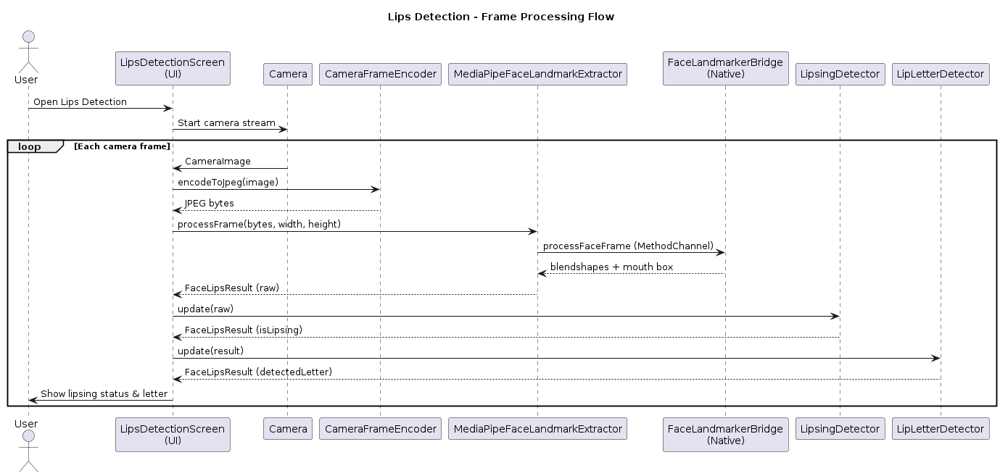
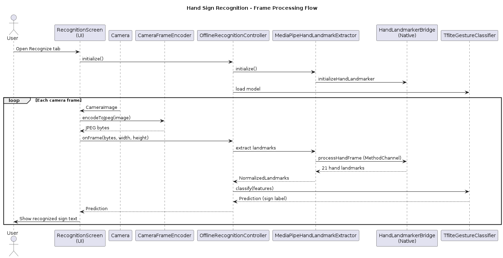
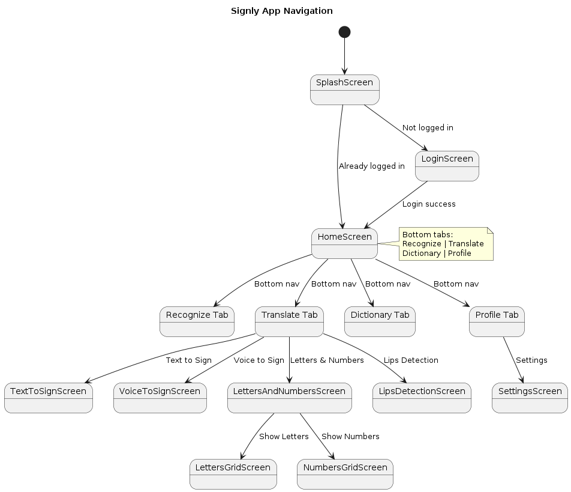
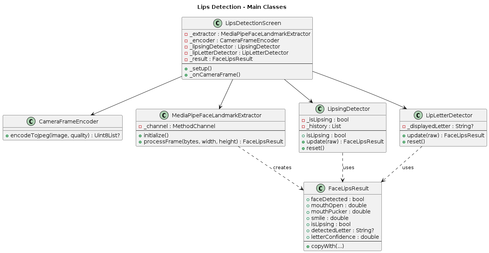
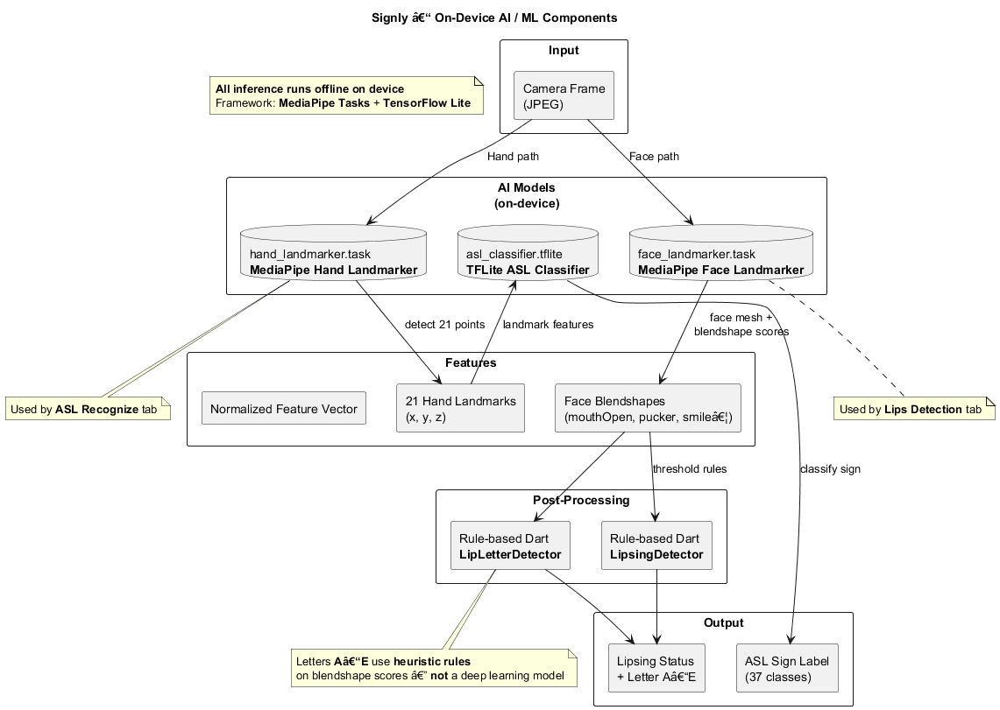

# Signly — Offline ASL & Lips Detection App

**Signly** is a Flutter mobile app that helps people learn and use **American Sign Language (ASL)** without needing an internet connection.

It combines on-device hand recognition, text/voice translation into signs, and lips (mouth-movement) detection so learners, Deaf and hard-of-hearing users, and anyone practicing ASL can communicate and study anywhere — even offline.

## How Signly Helps

| Who it helps | How |
|---|---|
| ASL learners | Practice letters and words with live camera feedback and a dictionary |
| Deaf / hard-of-hearing users | Convert typed or spoken text into visual signs (GIFs and finger-spelling) |
| Anyone practicing mouth cues | Lips detection shows whether mouth movement / lipsing is happening |
| Users with weak connectivity | All recognition runs **on the phone** (MediaPipe + TFLite) — no cloud required |

## What The App Does

- **Splash & onboarding** — introduce the product and guide first-time users  
- **Login / signup** — simple local auth flow  
- **ASL recognition** — camera reads hand landmarks and classifies letters/digits offline  
- **Translate hub**
  - **Text to Sign** — type words; known words play GIFs, others are finger-spelled  
  - **Voice to Sign** — speak into the mic; speech becomes signs  
  - **Letters & Numbers** — browse A–Z and 0–9 with reference images  
  - **Lips Detection** — front camera tracks mouth open / lipsing and related letter cues  
- **Dictionary & practice** — look up signs and practice with feedback  
- **Profile / settings** — account and app preferences  

## Project Diagrams

All diagrams below are PNG images from [`diagrams/`](diagrams/).

### 1. Use Cases

**What it shows:** Every main action a user can take inside Signly.

**Explanation:** The actor (user) can log in, recognize ASL from the camera, convert text or voice into signs, browse letters & numbers, run lips detection, open the dictionary, and manage a profile. Recognition and lips **include** camera use; voice-to-sign **includes** the microphone. Optional extensions cover confidence display, matching a target letter while practicing lips, and finger-spelling unknown words.



### 2. System Architecture

**What it shows:** How the app is structured in layers from UI down to on-device AI models.

**Explanation:** Flutter screens (recognition, translate, lips, dictionary, settings) talk to application services (`OfflineRecognitionController`, `SignTranslationEngine`, lips detectors). Those use infrastructure wrappers for MediaPipe and TFLite, which call native Android/iOS bridges, which load the `.task` and `.tflite` model files stored on the phone.


### 3. Lips Detection Sequence

**What it shows:** The ordered steps for processing one face/lips camera frame.

**Explanation:** The camera frame is encoded as JPEG, sent through the Face Landmarker bridge, and converted into mouth-related blendshape scores. Rule-based detectors decide if the user is lipsing and which simple lip letter cue (A–E) fits, then the UI updates with mouth-open feedback.



### 4. Hand Recognition Sequence

**What it shows:** The ordered steps for offline ASL hand recognition.

**Explanation:** Each camera frame is encoded, passed to MediaPipe Hand Landmarker to get 21 hand points, turned into a feature vector, classified by the TFLite ASL model, then smoothed/debounced by the recognition controller so the UI shows a stable letter or digit instead of flickering predictions.



### 5. App Navigation

**What it shows:** How users move between screens in the app.

**Explanation:** Flow starts at Splash → Login/Signup → Home tabs. From Home, users reach Recognize, Translate (text-to-sign, voice-to-sign, letters & numbers, lips detection), Dictionary, Practice, and Profile/Settings. This map is useful for understanding UX and for documenting the graduation project screens.



### 6. Lips Detection Classes

**What it shows:** The main Dart/native classes that power lips detection and how they connect.

**Explanation:** The lips screen depends on a face landmark extractor (via the native face bridge), plus `LipsingDetector` and `LipLetterDetector` for temporal/rule-based decisions. This diagram helps developers see responsibilities when changing lips logic or debugging face-model issues.



### 7. On-Device AI Components

**What it shows:** The AI/ML pieces that run fully offline on the device.

**Explanation:** Signly uses three models: MediaPipe **Hand Landmarker**, MediaPipe **Face Landmarker**, and a custom **TFLite ASL classifier**.  
- **Hand path:** camera → hand landmarks → TFLite → ASL label (37 classes: A–Z, 0–9, space).  
- **Face path:** camera → face blendshapes → rule-based lipsing / lip-letter logic → lipsing status and letter cues.  
No cloud API is required for recognition or lips detection.



## Run The App

From the project root:

1. `flutter pub get`
2. Ensure these files exist:
   - `assets/models/asl_classifier.tflite`
   - `assets/models/labels.json`
   - `assets/sign_language/letters/` (37 PNGs: a–z, 0–9, space)
   - `assets/sign_language/gifs/` (hello, you, good, morning GIFs)
3. Add MediaPipe models:
   - `android/app/src/main/assets/hand_landmarker.task`
   - `android/app/src/main/assets/face_landmarker.task`
   - iOS: copy both `.task` files into `ios/Runner/` and add to Xcode bundle
4. Run:
   - `flutter run`

To prepare TFLite + sign assets:

```bash
python prepare_mobile_assets.py
```

Face landmarker download:  
https://storage.googleapis.com/mediapipe-models/face_landmarker/face_landmarker/float16/1/face_landmarker.task

## Technical Notes

- Method channel `asl/offline/landmarks` — hand landmarker init + frame processing  
- Method channel `asl/offline/face` — face landmarker init + frame processing  
- Hand pipeline: camera → JPEG → MediaPipe landmarks → 42 features → TFLite → smoothing → text  
- Lips pipeline: camera → Face Landmarker blendshapes → `LipsingDetector` → UI  
- Translation: `SignTranslationEngine` plays letter PNGs and word GIFs  

## Important

- Missing `hand_landmarker.task` → ASL recognition fails to initialize  
- Missing `face_landmarker.task` → Lips Detection fails with a clear error  
- Voice-to-sign needs mic permission (Android `RECORD_AUDIO`, iOS mic + speech recognition)  
