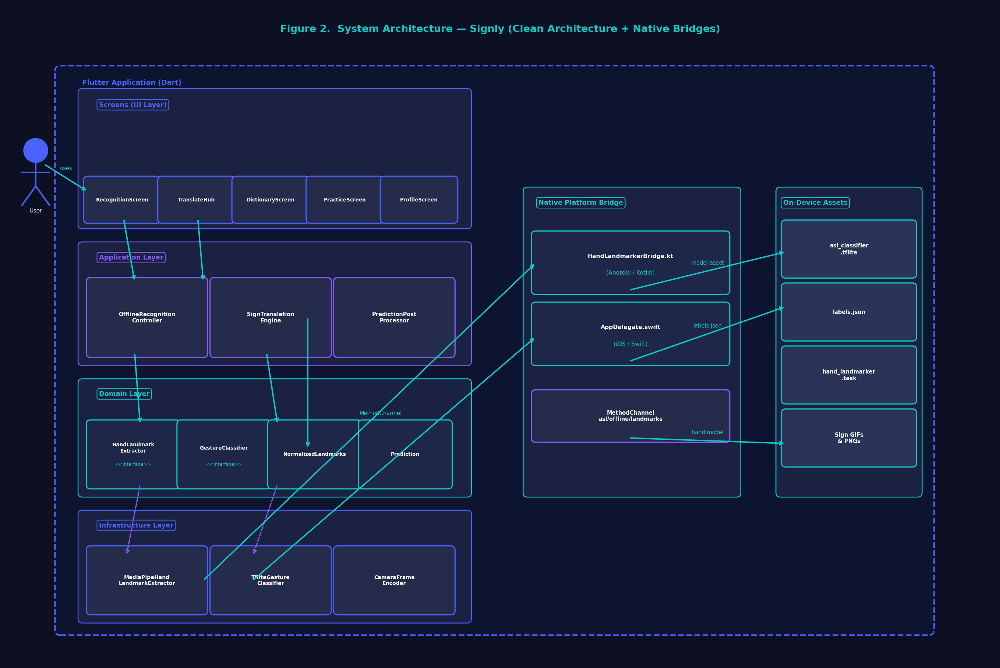
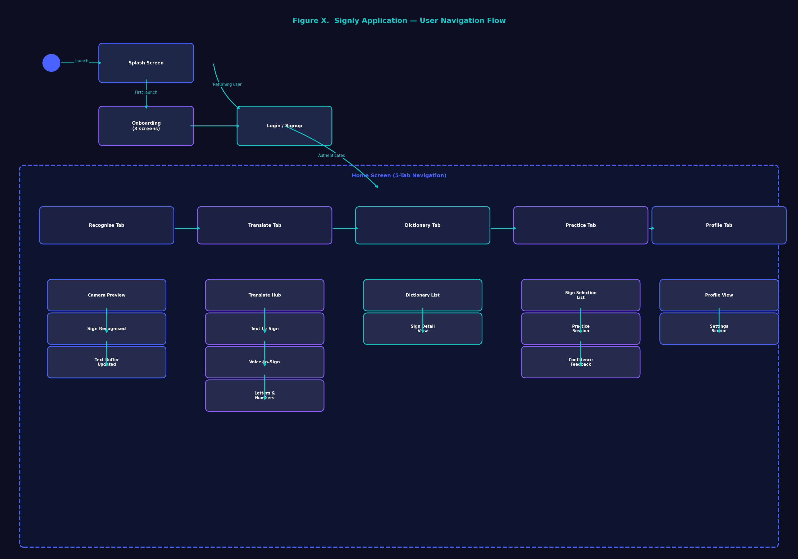
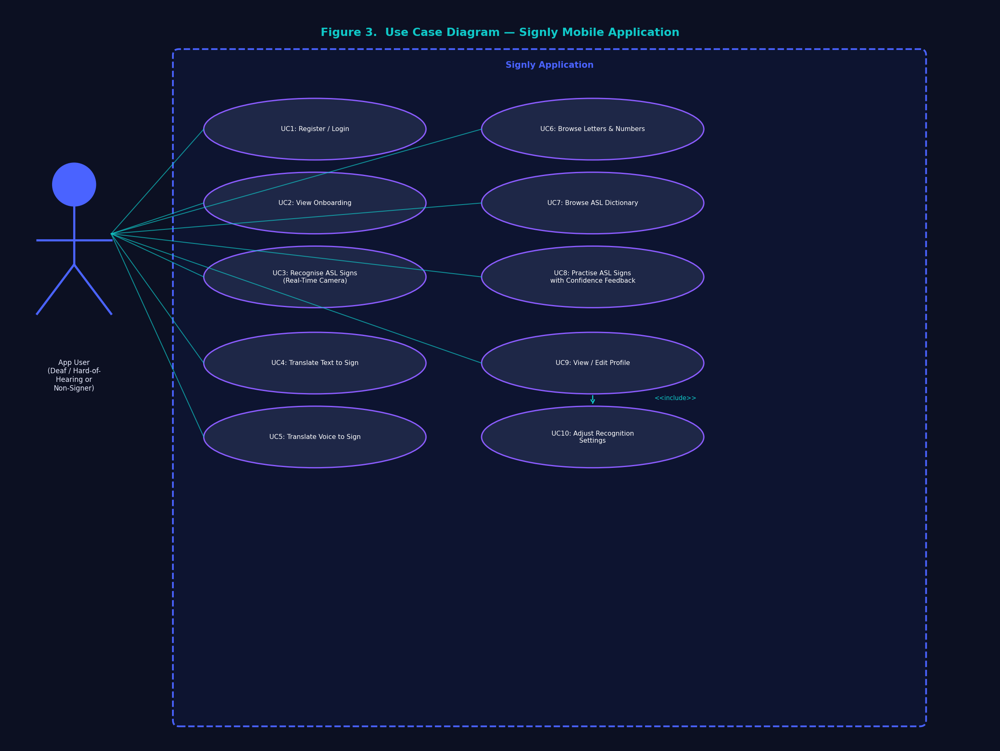
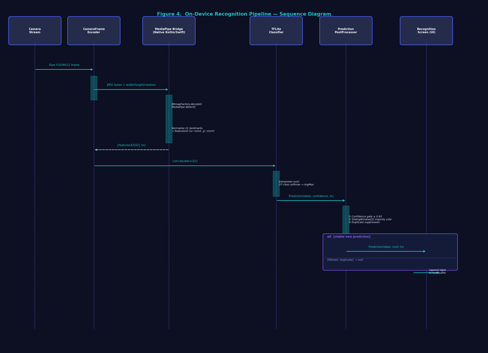
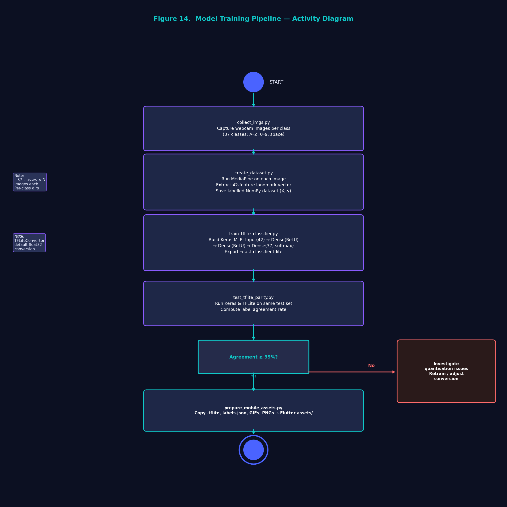

# Mobile Offline ASL App (Signly)

This is now a full Flutter app flow:

- animated splash
- onboarding
- login and signup
- home with offline ASL camera recognition
- **Translate tab**: text-to-sign, voice-to-sign, letters & numbers, lips detection

## Project Diagrams

### System Architecture

End-to-end layout of the Flutter UI, application logic, MediaPipe landmarks, and on-device TFLite classification.



### User Flow

How a user moves through splash, onboarding, auth, home, recognition, and translate features.



### Use Cases

Main actor goals supported by the app: recognize signs, practice, translate text/voice, and detect lipsing.



### Recognition Sequence

Frame-by-frame pipeline from camera capture to stabilized letter/word output.



### Training Pipeline

How landmark samples become the exported TFLite model used offline on the phone.



## Run The App

From the project root:

1. `flutter pub get`
2. Ensure these files exist:
   - `assets/models/asl_classifier.tflite`
   - `assets/models/labels.json`
   - `assets/sign_language/letters/` (37 PNGs: a–z, 0–9, space)
   - `assets/sign_language/gifs/` (hello, you, good, morning GIFs)
3. Add MediaPipe models:
   - `android/app/src/main/assets/hand_landmarker.task`
   - `android/app/src/main/assets/face_landmarker.task`
   - iOS: copy both `.task` files into `ios/Runner/` and add to Xcode bundle
4. Run:
   - `flutter run`

To copy TFLite model + sign language assets from the main project:

```bash
python prepare_mobile_assets.py
```

Face landmarker download:
https://storage.googleapis.com/mediapipe-models/face_landmarker/face_landmarker/float16/1/face_landmarker.task

## Translate Features

Open the **Translate** tab from the bottom navigation:

| Feature | Description |
|---|---|
| Text to Sign | Type text; known words play GIFs, unknown words are finger-spelled |
| Voice to Sign | Tap mic, speak, tap again; signs play after recognition |
| Letters & Numbers | Browse A–Z and 0–9 grids with full sign images |
| Lips Detection | Front camera + MediaPipe Face Landmarker; shows mouth open % and lipsing yes/no |

Voice-to-sign requires microphone permission (Android `RECORD_AUDIO`, iOS mic + speech recognition).

## Architecture

- Method channel: `asl/offline/landmarks`
  - `initializeHandLandmarker()`
  - `processFrame({bytes, width, height, rotation}) -> {features42, ts} | null`
- Method channel: `asl/offline/face`
  - `initializeFaceLandmarker()`
  - `processFaceFrame({bytes, ...}) -> {faceDetected, mouthOpen, mouthPucker, smile, ts}`
- Camera stream -> JPEG frame encode -> MediaPipe landmarks -> normalized 42 features -> TFLite classifier -> smoothing/debounce -> recognized text.
- Lips: camera -> Face Landmarker blendshapes -> `LipsingDetector` temporal logic -> UI.
- Sign translation: shared `SignTranslationEngine` plays letter PNGs and word GIFs with original timing from the source app.

## Important

- If `hand_landmarker.task` is missing, recognition initialization fails and shows an error.
- If `face_landmarker.task` is missing, Lips Detection initialization fails with a clear error.
- Sign language assets are copied from `Sign-Languag-App-main/Sign-Languag-App-main/assets/` via `prepare_mobile_assets.py`.
